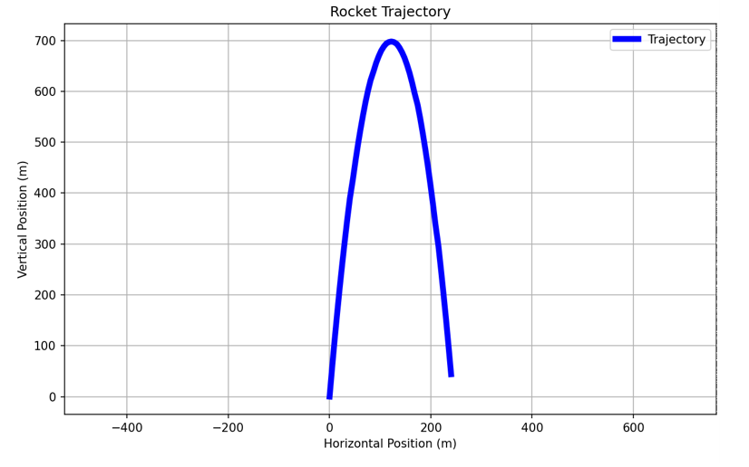

# Project Documentation EGR 115

This project is a calculator that tracks the trajectory of a rocket using advanced physics. With the use of simple inputs the calculator can accurately determine apogee, position and velocity of the rocket. The purpose of the project was to make an easy way to calculate different things required to know to have a successful rocket launch.

## Project Results
